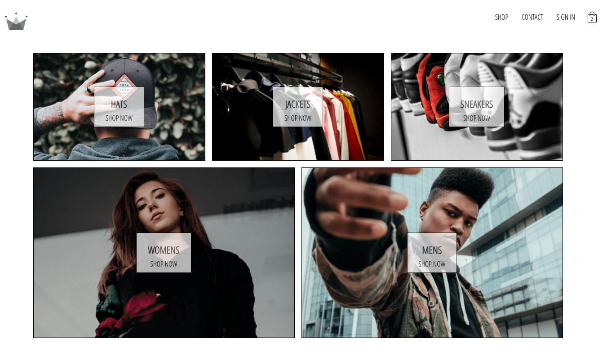

# CROWN CLOTHINGS E-COMMERCE APP

In this project, I developed an E-commerce application with React, Redux, Stripe and Firebase.

The application features includes:
- A proper Authentication for Sign in and Sign up using Firebase
- Persist user cart items using persistor package 
- Accept payment using Stripe API



## Live Demo
[Live Demo](https://cush-clothing.herokuapp.com/)
## Getting Started

To get a local copy up and running follow these simple example steps.

### Prerequisites

Make sure Node.js is running on your local machine

### Setup

~~~bash
$ git clone https://github.com/acushlakoncept/crown-clothing.git
$ cd crown-clothing
~~~

Install modules:

```
yarn add
```

### Usage

Start server with:

```
    yarn start or npm start
```
### Running Test
Jest is used to run all the tests found in this application
In order to run the test you can simply type `yarn test` or `npm run test`

Either ways, if you encounter any error while running either command, its likely you do not have `jest` installed globally, so please run `npm install -g jest-cli` then try again. That should do it.

### Deployment instructions

```
    git add .
    git commit -m "ready for first push to heroku"  
    _~heroku create $APP-NAME --buildpack mars/create-react-app~_
    git push heroku $BRANCH_NAME:master
```

Fire up your app by running `heroku open` Yay!!! your app has been deployed successfully.

# Authors

👤 **Uduak Essien**

- Github: [@acushlakoncept](https://github.com/acushlakoncept/)
- Twitter: [@acushlakoncept](https://twitter.com/acushlakoncept)
- Linkedin: [acushlakoncept](https://www.linkedin.com/in/acushlakoncept/)

## 🤝 Contributing

Contributions, issues and feature requests are welcome!

Feel free to check the [issues page](issues/).

## Show your support

Give a ⭐️ if you like this project!

## Acknowledgments
- A follow along tutorial from [Zero to Master React Course](https://www.udemy.com/course/complete-react-developer-zero-to-mastery/)
